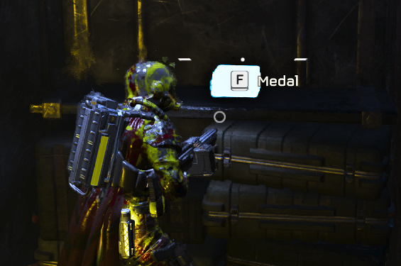
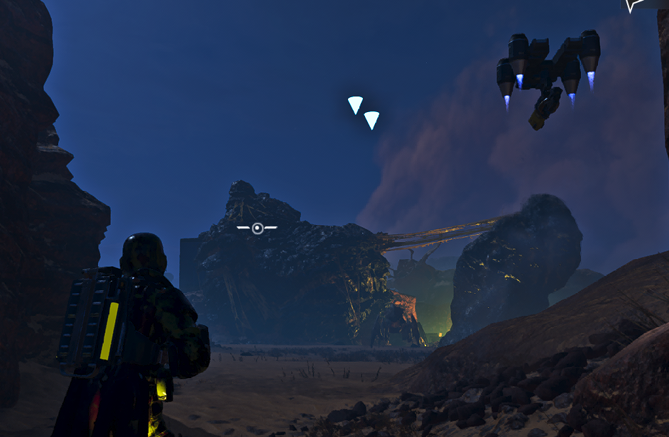

# Highlight Samples mod for Helldivers 2
**Disclaimer:** The mod isn't made by me and I don't know who is the author.  

The mod applies glowing textures to Common and Rare samples, Super Credits and Medals, making them much easier to detect.  
Also it shows a glowing cube or Arrow above Bunkers and destroyable Containers, where loot can be found.

## How to install
1. Download and use [Helldivers 2 ModManager](https://github.com/teutinsa/Helldivers2ModManager).  
2. Use the zip from the [Release](https://github.com/igromanru/Helldivers-2-Highlight-Samples/releases) section or create a zip file with `9ba626afa44a3aa3.patch_0`, `9ba626afa44a3aa3.patch_0.gpu_resources` and `9ba626afa44a3aa3.patch_0.stream` yourself.
3. Setup the Helldivers 2 ModManager for your games directory, then  **Add**  the Zip and use **Deploy** button to active all your installed mods. 

You can find a Video tutorial here: https://www.youtube.com/watch?v=FGKZV9ffYko  
Or simple Google how to use it.

## Preview

